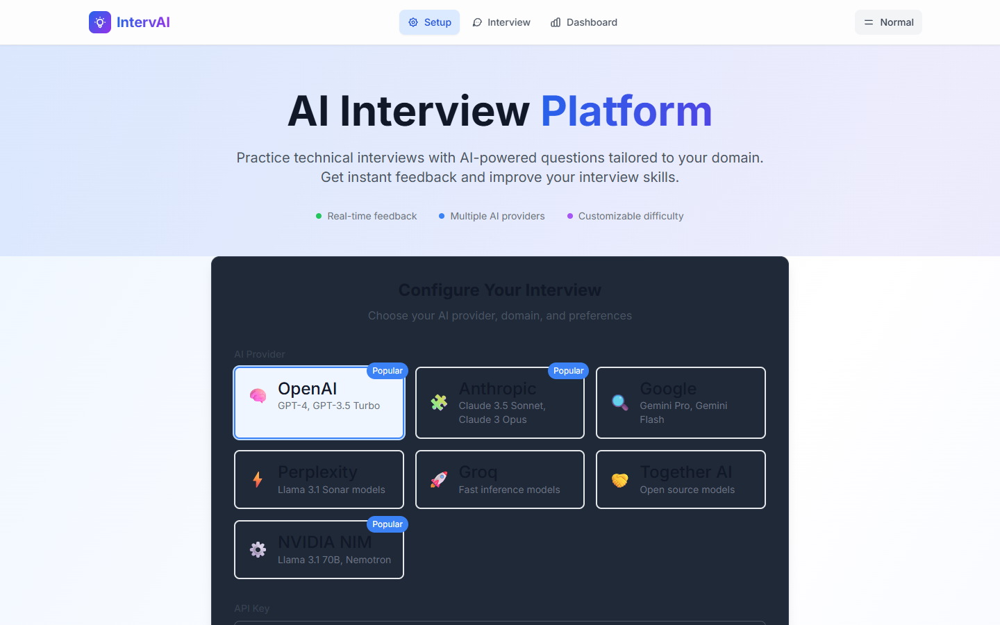
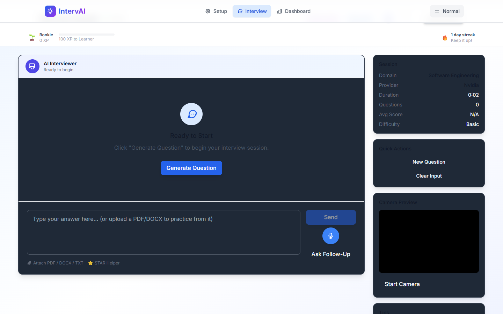
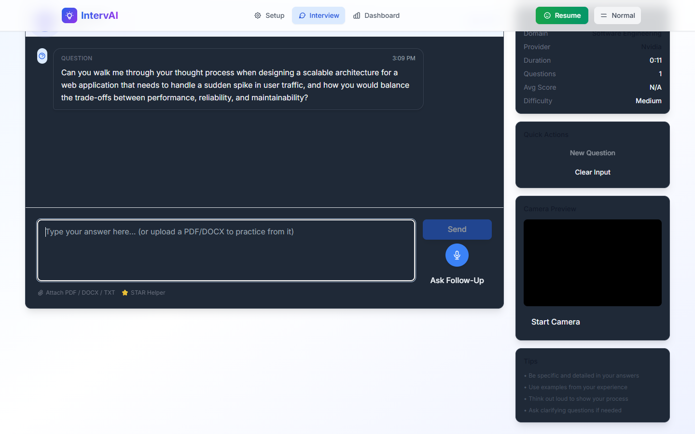
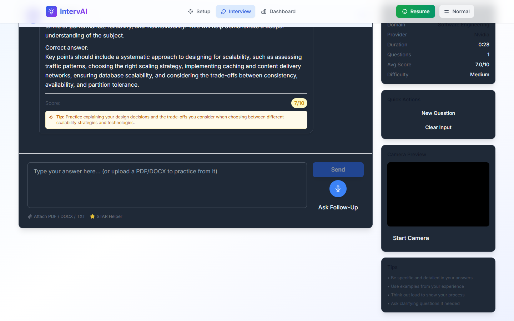
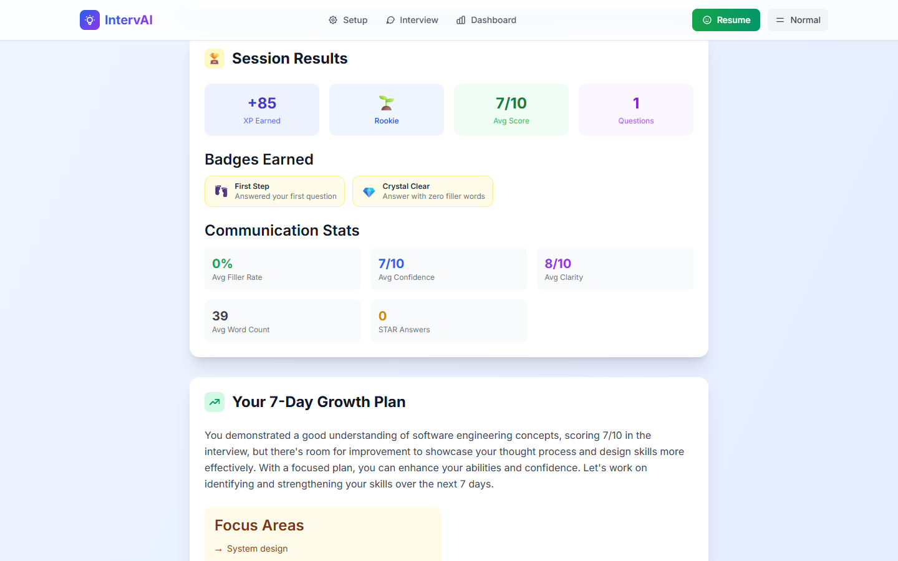
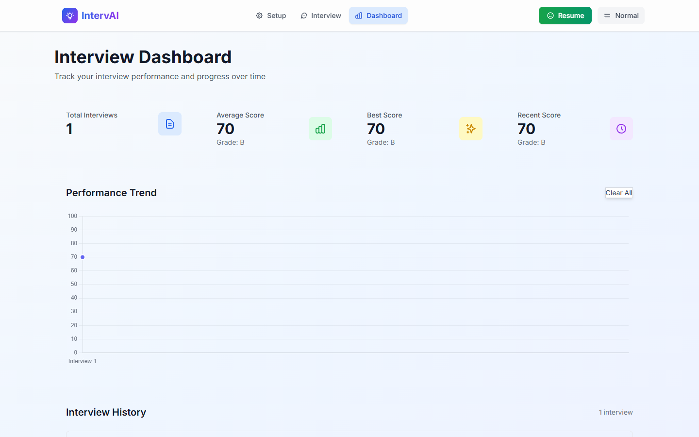

# IntervAI — AI Mock Interview Platform

> An AI interviewer that actually behaves like a human.
> Silence detection. Live interruptions. Adaptive personality. Honest feedback.

---

## Screenshots

### Setup — Provider, domain, difficulty, and interviewer personality


### Interview — AI Presence Zone + live avatar states


### Interview — Question streaming with speaking indicator


### Interview — Feedback with score, verdict, and improvement tip


### Summary — XP, badges, communication stats, 7-day growth plan


### Dashboard — Score history and performance trend


---

## What is IntervAI?

IntervAI is a **realistic mock interview simulator** built to feel like a real interviewer — not a chatbot.

Most interview tools ask a question, wait for your answer, and give generic feedback. IntervAI **observes behavior** in real time: it detects when you hesitate, nudges you when you're silent too long, interrupts when you're rambling, and adapts its tone based on your chosen interviewer personality.

---

## Feature Overview

### Behavioral Intelligence (what makes it different)

| Behavior | How it works |
|----------|-------------|
| **Silence detection** | 18s idle → AI nudges you to start. 10s mid-answer pause → AI pushes you to continue |
| **Verbose interrupt** | 130+ words typed with a 6s pause → AI cuts in: *"Hold on — what's your single most important point?"* |
| **Content-aware interruption** | Detects hedging words, algorithm terms, filler, topic-jumping, vague claims → asks a targeted follow-up |
| **Streaming TTS** | AI starts speaking sentences as they arrive — no waiting for the full response |
| **Filler prefix** | Before nudges: *"Hmm, interesting."* / *"Noted."* — feels like a human collecting their thoughts |

### Interviewer Personalities

| Persona | Voice rate | Feel |
|---------|-----------|------|
| Friendly Mentor | 0.88x | Warm, encouraging, builds confidence |
| Strict Interviewer | 1.0x | Formal, terse, high expectations |
| Startup Founder | 1.12x | Impatient, challenging, high pressure |
| Silent Observer | 0.83x | Minimal feedback, pressure through silence |

### Interview Engine
- **Adaptive soul engine** — tracks confidence, topic depth, adjusts difficulty round-by-round
- **Question types**: Conceptual · Practical · Scenario · Coding · Behavioral · Case Study
- **Smart follow-ups** — auto-triggered when score < 7, drills weak spots
- **Document upload** — attach PDF/DOCX resume or notes, AI generates questions from it
- **Company tracks** — FAANG, startup, consulting, and more

### Voice System
- **Whisper STT** (OpenAI · Groq) — speak your answers, get accurate transcription
- **OpenAI TTS** — AI reads questions aloud with `nova` voice, streams audio
- **Browser TTS fallback** — works on every provider without extra API keys
- **Streaming TTS** — speaks sentence-by-sentence as question generates, not after

### Anti-Cheat
- Tab-switch detection, copy/paste monitoring, right-click blocked
- Integrity score badge (green → yellow → orange → red) in header

### Interview UI
- **AI Presence Zone** — animated SVG avatar with 6 live states: idle, waiting, thinking, evaluating, speaking, armed (about to interrupt)
- Per-question countdown timer with **stress mode** (audio beeps last 10s)
- Camera preview, STAR method helper, document upload
- Word count indicator — amber at 80 words, red at 130 words

### Gamification + Progress
- XP per answer, bonus for STAR answers and zero filler words
- Achievement badges, communication stats (filler rate, confidence, clarity)
- Growth plan generated at session end
- Dashboard with score history across all sessions

---

## AI Providers

| Provider | Questions | Whisper STT | Premium TTS |
|----------|-----------|-------------|-------------|
| OpenAI | ✅ | ✅ | ✅ tts-1 |
| Anthropic | ✅ | — | Browser TTS |
| Google Gemini | ✅ | — | Browser TTS |
| Groq | ✅ | ✅ | Browser TTS |
| NVIDIA NIM | ✅ | — | Browser TTS |
| Together AI | ✅ | — | Browser TTS |
| Perplexity | ✅ | — | Browser TTS |
| Demo / Offline | ✅ local bank | — | Browser TTS |

> No API key? Set `api_key = demo` — IntervAI falls back to the built-in question bank.

---

## Architecture

```
IntervAI/
├── frontend/                  React + Vite + Tailwind
│   └── src/
│       ├── pages/             Interview.jsx · Setup.jsx · Summary.jsx · Dashboard.jsx
│       ├── components/        MessageBubble · MicButton · GamificationBar · StarMethodHelper
│       ├── hooks/             useVoice · useAntiCheat · useSilenceDetector · useInterruptDetector
│       └── config/            personality.js
└── backend/                   FastAPI + Uvicorn
    └── app/
        ├── routes.py          All /interview/* endpoints
        ├── soul_engine.py     Adaptive question/evaluation prompt builder
        ├── llm_client.py      Unified LLM abstraction (streaming + non-streaming)
        └── config.py          Settings (CORS origins, env vars)
```

### Key API Endpoints

| Method | Endpoint | Description |
|--------|----------|-------------|
| POST | `/interview/start` | Start session |
| GET | `/interview/question/stream` | Next question (SSE streaming) |
| POST | `/interview/answer` | Submit answer — score, feedback, analysis |
| POST | `/interview/followup` | Follow-up question |
| POST | `/interview/end` | End session — summary + gamification |
| POST | `/interview/transcribe` | Whisper STT |
| POST | `/interview/speak` | OpenAI TTS — returns audio/mpeg |
| POST | `/interview/upload_document` | Upload PDF/DOCX/TXT |
| POST | `/interview/growth_plan` | Personalized improvement plan |

---

## Quick Start

### Docker (dev)

```bash
docker-compose up --build
# Frontend: http://localhost:5173
# Backend:  http://localhost:8000/docs
```

### Local dev

```bash
# Backend
cd backend
pip install -r requirements.txt
uvicorn app.main:app --reload --port 8000

# Frontend (new terminal)
cd frontend
npm install
npm run dev
# → http://localhost:5173
```

---

## Deployment

### Backend → Railway

1. Connect this repo in Railway
2. Set env var: `ALLOWED_ORIGINS=https://your-app.vercel.app`
3. Railway auto-detects `railway.toml` and deploys

### Frontend → Vercel

1. Import repo, set root directory to `frontend/`
2. Set env var: `VITE_API_BASE_URL=https://your-backend.railway.app`
3. Deploy — `vercel.json` handles SPA routing

### Self-hosted (Docker)

```bash
ALLOWED_ORIGINS=https://yourdomain.com \
VITE_API_BASE_URL=https://yourdomain.com:8000 \
docker compose -f docker-compose.prod.yml up -d
```

---

## Pricing

| Plan | Price | Sessions | Personalities | Voice |
|------|-------|----------|--------------|-------|
| Starter | Free | 5 / month | Friendly only | Browser TTS |
| Pro | $12 / mo | Unlimited | All 4 | Whisper + OpenAI TTS |
| Teams | $39 / mo | Unlimited | All 4 | Everything + team analytics |

---

## Troubleshooting

| Issue | Fix |
|-------|-----|
| `ERR_CONNECTION_REFUSED` | Backend must run on port 8000 |
| Whisper STT fails | Falls back to browser speech automatically |
| NVIDIA 401 | Check your `nvapi-...` key at build.nvidia.com |
| CORS error in production | Set `ALLOWED_ORIGINS` env var on backend |
| Voice not working | Browser requires HTTPS or localhost for Web Speech API |

---

## Roadmap

- [x] Phase 1: Interview engine, soul engine, streaming, gamification, stress mode
- [x] Phase 2: Voice I/O (Whisper + TTS), anti-cheat, session history
- [x] Phase 2.5: Behavioral intelligence — silence detection, content-aware interrupts, personality system
- [x] Phase 3: Launch prep — Railway/Vercel deploy, production Docker, pricing page
- [ ] Phase 4: AI Avatar (D-ID or NVIDIA ACE animated face)
- [ ] Phase 5: Face detection, eye tracking, attention scoring
- [ ] Phase 6: Enterprise — ATS integration, multi-tenant, team analytics

---

## License

Copyright (c) 2026 IntervAI. All rights reserved.
This is proprietary software — see [LICENSE](LICENSE) for terms.
Commercial licensing and institutional use: https://rajbharti.in

---

> Practice here. Perform out there.
