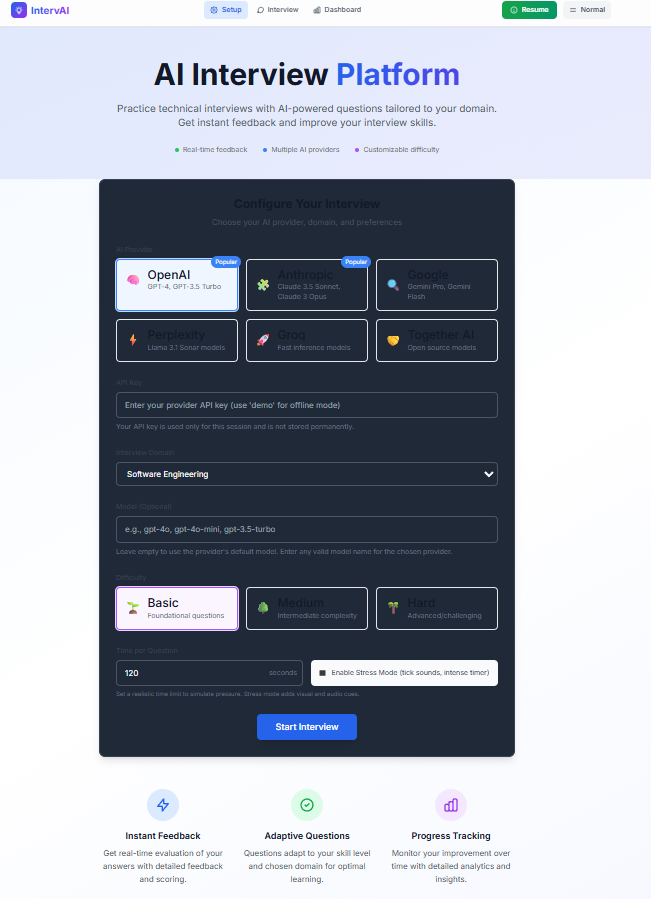
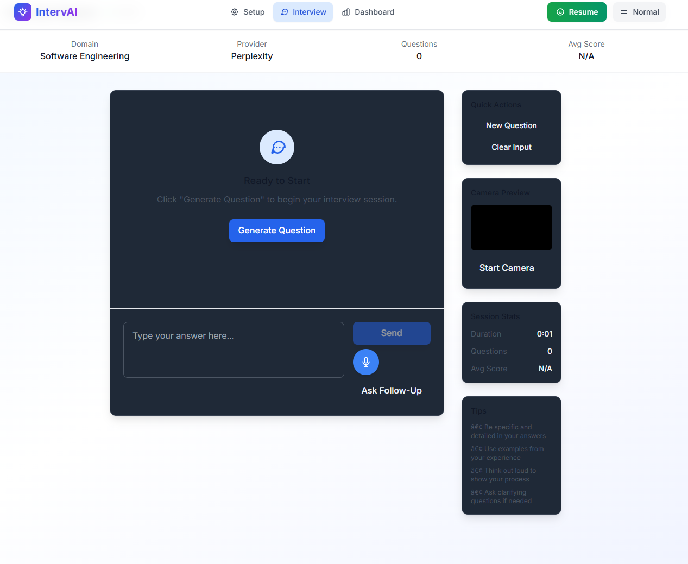
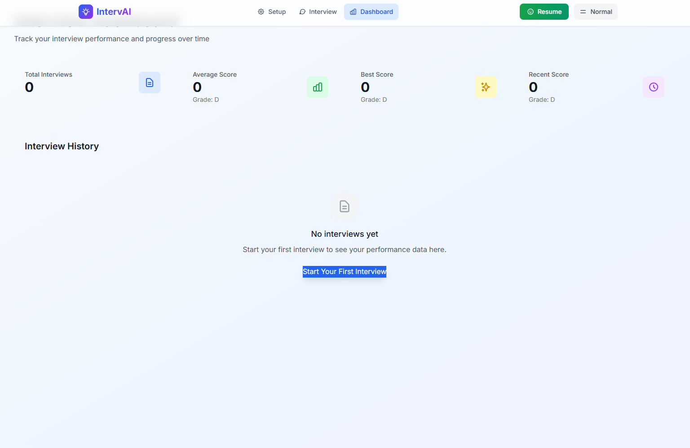

# 🎤 IntervAI — Practice the Interview. Become the Candidate.

> **Old-school preparation, new-school intelligence.**
> IntervAI is an AI-powered mock interview platform that doesn’t just ask questions — it *thinks with you*, adapts to you, and pushes you one level higher every round.

---

## 🧭 What is IntervAI?

**IntervAI** is a **realistic mock interview simulator** designed to feel like a tough-but-fair human interviewer.

Not flashy. Not gimmicky. Just sharp questions, honest feedback, and pressure that makes you better.

Think of IntervAI as:

* 🧠 a **practice room** before the real room
* 🎯 a **coach** that adjusts difficulty as you grow
* ⏱️ a **stress trainer** when you want realism
* 📊 a **mirror** that shows where you truly stand

Built for engineers, students, and serious candidates.

---

## ✨ Core Philosophy

* **Preparation beats luck** — interviews reward clarity, not chance
* **Difficulty should adapt** — growth lives just past comfort
* **Offline-first matters** — learning shouldn’t depend on APIs
* **Feedback > fancy UI** — insight is the real feature
* **Respect the classics** — structured interviews still win

IntervAI is not about shortcuts.
It’s about **showing up ready**.

---

## 🚀 Highlights

* 📈 **Adaptive difficulty** — foundational → intermediate → advanced
* 🧩 **Diverse question types**:

  * Conceptual
  * Practical
  * Scenario-based
  * Coding
  * Behavioral
* 🔁 **Smart follow-ups** based on your answers
* 🧮 **Answer evaluation & scoring** per question
* ⏱️ **Per-question timer** with optional **stress mode** (audio cues)
* 📴 **Offline / Demo mode** — no API keys required
* 🛟 **Resilient backend** with graceful fallbacks

---

## 📸 Screenshots

### Setup Page



### Interview Page



### Dashboard Page



---

## 🏗️ Architecture Overview

* **Frontend**: React + Vite + Tailwind
  `IntervAI/frontend`

* **Backend**: FastAPI + Uvicorn
  `IntervAI/backend`

* **Routing**:

  * `app/main.py` → registers routes
  * `app/routes.py` → `/interview/*` endpoints

* **Logic**:

  * Adaptive difficulty engine
  * Local question bank for demo/offline mode
  * Provider-agnostic LLM interface

---

## ⚡ Quick Start

### Option A: Docker (Recommended)

**Requirements**: Docker, Docker Compose

```bash
docker-compose up --build
```

* Frontend: [http://localhost:5173/](http://localhost:5173/)
* Backend: [http://localhost:8000/](http://localhost:8000/)
* API Docs: [http://localhost:8000/docs](http://localhost:8000/docs)

---

### Option B: Local Development

**Requirements**:

* Node.js ≥ 18
* Python ≥ 3.11

#### Backend

```bash
cd IntervAI/backend
./venv311/Scripts/python -m pip install -r requirements.txt
./venv311/Scripts/python -m uvicorn app.main:app --host 0.0.0.0 --port 8000 --reload
```

#### Frontend

```bash
cd IntervAI/frontend
npm install
npm run dev
```

Open:

```
http://localhost:5173/
```

---

## 🔌 AI Providers Supported

IntervAI supports **multiple AI providers** out of the box:

* OpenAI
* Anthropic
* Google
* Perplexity
* Groq
* Together AI

### 📴 Demo / Offline Mode

No keys? No problem.

On the **Setup page**:

* Set `api_key = demo` (or `test`)
* IntervAI automatically switches to the **local question bank**

Perfect for:

* Demos
* Hackathons
* Offline practice
* Zero-cost testing

---

## 🔧 Configuration

### Frontend API Base

`IntervAI/frontend/src/config.js`

Uses:

```env
VITE_API_BASE_URL=http://localhost:8000
```

Create `.env` in `IntervAI/frontend` to override defaults.

---

## 📡 API Endpoints (POST)

* `/interview/start` — start a new interview session
* `/interview/question` — fetch next question
* `/interview/answer` — submit answer & get evaluation
* `/interview/followup` — request tailored follow-up
* `/interview/end` — end interview & generate summary
* `/interview/transcribe` — speech-to-text input
* `/interview/restore` — restore previous session

---

## 🎯 Usage Tips

* Start in **demo mode** to understand the flow
* Use **120s/question** for realistic pacing
* Enable **stress mode** once fundamentals are solid
* Watch difficulty badges — they don’t lie

---

## 🧪 Troubleshooting

**ERR_CONNECTION_REFUSED**

* Backend must be running on `http://localhost:8000`

**CORS issues**

* CORS is enabled for all origins by default

**Provider mismatch**

* Ensure provider matches API key type

**Port conflicts**

* Ensure ports `5173` and `8000` are free

---

## 🧪 Tests

Backend tests live in:

```
IntervAI/backend/tests
```

Covers:

* Question diversity
* Difficulty transitions
* Model/provider logic

---

## 🛣️ Roadmap

* 🎙️ Full voice-first interviews
* 📊 Session analytics & performance trends
* 🧠 Resume-based question generation
* 🪜 Company-specific interview tracks
* 📱 Mobile-friendly interview mode

---

## 🤍 Who This Is For

* Students preparing for placements
* Engineers grinding system design
* Candidates tired of vague prep advice
* Anyone who wants **honest interview practice**

---

## 📜 License

Add your preferred license.

---

## 🌌 Final Note

Interviews reward clarity, not confidence alone.

IntervAI exists to help you:

* think clearly
* speak precisely
* and walk into interviews already tested

Practice here — perform out there.
